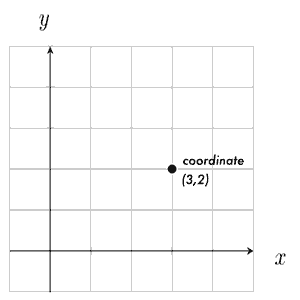

# Week 3 

## Pushing your Homework to Git

Quick version:
```bash
# cd 'openFrameworks/apps/hwork123_dtOf_2018'   # inside your hw folder

git add -A                                      # -A means add all files
git commit -m "week 3 homework"                 # commit files, with a log message 
git push origin master                          # sync with GitHub origin ('master' / default branch)
```

[Click here for more explanation of these commands.](../HOMEWORK.md) 


## Week 3 Homework

### Reading

1. **Read all of the [Animation](http://openframeworks.cc/ofBook/chapters/animation.html)** chapter in **ofBook**.  
This will review the concepts of vectors and force, and introduce more information that will be important for your homework and the next class.

2. **Skim either:**
    * **[The Nature of Code - Chapter 2 - Book](http://natureofcode.com/book/chapter-2-forces/)**  
    * **[The Nature of Code - Chapter 2 - Videos](https://www.youtube.com/watch?v=II1A3bBo6gM&list=PLRqwX-V7Uu6ZRrqLcQ5BkBKmBLiGD8n4O)**


### Code Sketches

1. **Windy**  
    Create a scene with multiple moving objects, like the Bouncing Ball example.  
    Add a "wind" force that pushes your objects around the scene.  
    Try adding multiple winds that change over time!  (_hint:_ `float time = ofGetElapsedTimef(); // current time in seconds`)

2. **Moving Portrait**  
    Create a "self-portrait" using shapes and colors.  Use interpolation to animate the shapes in some way - perhaps the color changes over time, or in response to mouse movement... Get creative!

3. Don't forget to **[push](../HOMEWORK.md)** your sketches to your homework repo on GitHub **before class**:


## Code Examples

* **gravity** adding acceleration (gravity) to the old Bouncing Ball example
* **lerp_basic** illustration of interpolation and "Zeno" easing technique
* **lerp_worm** using ofMap to create a multicolor worm that follows the mouse

## Review

### Graphics: Vectors and Coordinates

In math and graphics, we use the term "vector" to describe a position in 2D (or 3D, 4D...) space.  A "vector" is simply a set of values.  A 2-dimensional vector has 2 values: _x_ and _y_.  

In openFrameworks, we use **glm::vec2** as our 2D vector class.  (**glm** is a math graphics library recently added to openFrameworks.  **glm::vec2** means "**glm**'s **vec2** class")

You can think of a vector as a position in space -  
**or** as an arrow pointing from the origin _(0,0)_ to that position _(x,y)_.  
This arrow represents both a _direction_ (angle of arrow) and a _magnitude_ (length).  



In class, we'll use `glm::vec2` to represent positions and movement in space.

We can do lots of useful things with vectors - like adding, subtracting and scaling (multiplying) them:

```c++
glm::vec2 addVec    = glm::vec2(1,1) + glm::vec2(2,3); 
// == (3,4) 

glm::vec2 subVec    = glm::vec2(1,1) - glm::vec2(2,3);
// == (-1,-2)

glm::vec2 scaledVec = glm::vec2(2,3) * 2.; 
// == (4,6)
```

**Note:** 
A vector with a length of 1.0 is called a _"unit vector"_.  This is useful sometimes to represent just a direction.  
To find a unit vector, we divide any vector by its length - this is called _"normalizing"_ the vector.  
The unit vector can then be _scaled_ to a new length: `unitVector *= magnitude`


### Interpolation

Interpolation is a like a smooth transition from one value to another.   
It's a very handy concept for creating animations.

We can use interpolation to smoothly move things, scale things, change colors, etc.

The magic interpolation formula is:  

`C = A + percent * (B - A)`

where `percent` is the amount of interpolation between `A` and `B` (on a scale from 0.0 to 1.0).

_Think of it like this:_   

We start at `A` (`C = A`).  We want to "travel" (`+`) some percent of the distance to `B`.   
The distance is calculated by `(B - A)`, so the amount to travel is `percent * (B - A)`.

_Note:_ The formula above can be expanded to:
`C = A * (1-percent) + B * percent`

As an example, to interpolate 25% from 2.0 to 4.0:

```c++
float A = 2.0;
float B = 4.0;
float pct = 0.25;

//    C = A + pct * (B - A)

float C = 2 + 0.25 * (4.0 - 2.0); 
//    C = 2.5
```

### ofMap()

OpenFrameworks includes a nice function for interpolation, [`ofMap()`](http://openframeworks.cc/documentation/math/ofMath/#!show_ofMap).  
`ofMap` simply maps a value from one range to another.

For instance, we could map:  
the mouse X value on the screen `(0 - ofGetWidth())` to a brightness value `(0 - 255)`:

```c++
float brightness = ofMap(ofGetMouseX(), 0, ofGetWidth(), 0, 255);
// if mouse is halfway across the screen, brightness == 127.5
```

#### Zeno

The "Zeno" formula is based on [Zeno's paradox](https://en.wikipedia.org/wiki/Zeno%27s_paradoxes#Dichotomy_paradox):  

> Imagine you are in a room, and you are walking to a door -  
> with each step you take, you move exactly half way from your current spot to the door.   
> 
> As you approach the door, each step will be half as large as the last.  
> You will walk more and more slowly towards the door, never quite reaching it. 

This is a method of interpolation we call **easing**. It is a dynamic interpolation over time.  
It's one way of quickly modelling acceleration or deceleration.

In oF, we could implement it this way:

```c++
// ease ball position towards mouse using `Zeno` interpolation

void update(){
    // every frame, we will move a ball 10% of the way to a target
    
    float pct = 0.1; 
    ofVec2f target;
    target.x = ofGetMouseX(); // our target will be the mouse pos
    target.y = ofGetMouseY();
    
    // interpolation
    ball.position = ball.position * (1.-pct) + target * (pct);
}
```


### Movement and Force

We use vectors to represent both position, and movement, or _velocity_.  
Here's how we might use velocity to change position over time. 

```c++
glm::vec2 position = glm::vec2(1,1); // start at (1,1)
glm::vec2 velocity = glm::vec2(1,2); // move 1 along X axis, 2 along Y axis

void update() { 
    position += velocity;  // update position by adding velocity

    // position: (1,1) -> (2,3) -> (3,5) -> etc.
}
```

When a **force** is applied to an object in motion, it changes the velocity of the object.  
This is called **acceleration**, which we can also represent with an `glm::vec2`:

```c++
// create a downward acceleration force

glm::vec2 pos = glm::vec2(1,1);
glm::vec2 vel = glm::vec2(1,2);
glm::vec2 acc = glm::vec2(0,1);     // adjust velocity by (0,1) each frame

void update() { 
    vel += acc;     // update velocity by acceleration
    pos += vel;     // update position by velocity

    //           frame 0   frame 1  frame 2
    //           -------   -------  -------
    // accel   : (0,1)     (0,1)    (0,1)
    // velocity: (1,2) --> (1,3) -> (1,4) -> etc.
    // position: (1,1) --> (2,4) -> (3,8) -> etc.
}
```


