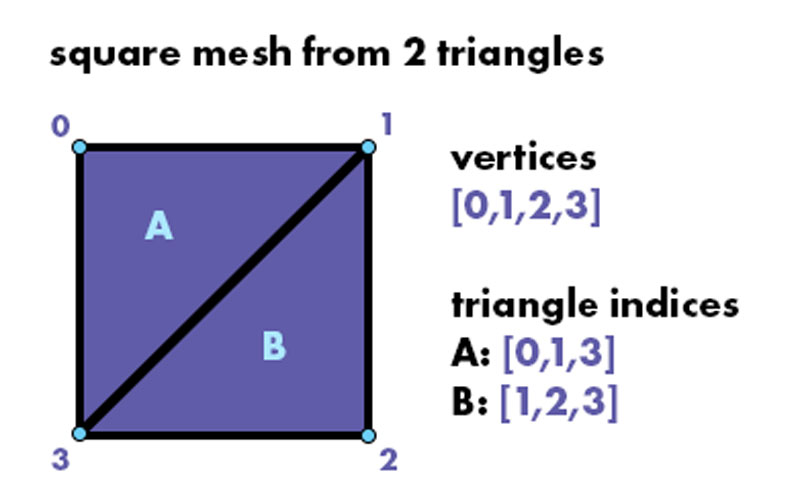

# Week 12

## Examples

  - **01_mesh_faces** - access and adjust the faces of a mesh
  - **02_mesh_webcam** - distort the vertices of a textured mesh based on image brightness
  - **03_color_channels** - separate the color channels of an image
  - **04_pixel_data** - write pixels to memory and create an image from scratch!
  - **05_glitch** - shift pixels to create glitch effect
  - **06_mesh_texture** - _new:_ draw a sphere mesh with lighting and planet texture
  - **07_OSC_mouse** - _new:_ send and receive OSC network messages

## Review

### 3D Meshes / `ofMesh`

A **mesh** is a collection of 3D points (_vertices_), connected by lines (a _wireframe_) to form a surface (_faces_).  

In oF, we use **[ofMesh](https://openframeworks.cc/documentation/3d/ofMesh)** to represent a 3D mesh. 

**ofMesh** stores the mesh data in collections, like:

  - **vertices:** the 3D mesh points - `ofMesh::getVertices(); // returns vector<glm::vec3>`
  - **indices:** the connections between points - `ofMesh::getIndices();	// returns vector<int>`

Typically, mesh **vertices** are connected as _triangles_ to form complex surfaces.

**Indices** are listed in groups of 3 to connect vertices into triangles.  
Each **index** refers to a point by its index in the vertices vector, i.e. `index = i --> vertex[i]`.  

_note:  
Indices should be listed in clockwise order when the triangle is seen from the front.  
Triangles have a front (clockwise) and back (counter-clockwise)._



**indices** = [ 0,1,3, 1,2,3 ]


**ofMesh** can also contain more (optional) mesh data -  
**texture coordinates**, and **normals**:  

  - **texture coordinates:** how the mesh surface maps to a 2D image (a **texture**) -  

	`ofMesh::getTexCoords();	// returns vector<glm::vec2>`
	
	One **texture coordinate** per index (so 3 per triangle).  
	Each represents a corresponding 2D position on the image.

  - **normals:** how the mesh faces are oriented to reflect light -  

  	`ofMesh::getNormals();	// return vector<glm::vec3>` 

	**Normals** are vector lines that stick out from the mesh surface.  
	There is one **normal** per index (so 3 per triangle).
	They are used to calculate 3D lighting effects (when lighting is enabled).


_note:  
ofMesh defaults to triangles, but you can set it to use alternate modes:_

```c++

ofMesh mesh;
mesh.setMode(OF_PRIMITIVE_TRIANGLES);	// ofMesh default mode - individual triangles

/* other types:
---------------
OF_PRIMITIVE_TRIANGLES, OF_PRIMITIVE_TRIANGLE_STRIP, OF_PRIMITIVE_TRIANGLE_FAN, 
OF_PRIMITIVE_LINES, OF_PRIMITIVE_LINE_STRIP, OF_PRIMITIVE_LINE_LOOP, OF_PRIMITIVE_POINTS
*/
```
Check out the [ofMesh documentation](https://openframeworks.cc/documentation/3d/ofMesh/#show_setMode) for more info on primitive modes.


